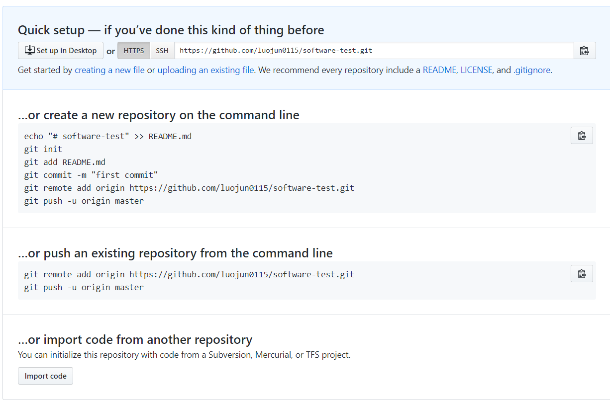

# 第一章：Git

## 1. Git的两大特点：

- 版本控制：可以解决多人同时开发的代码问题，也可以解决找回历史代码的问题
- 分布式：Git是分布式版本控制系统，同一个Git仓库，可以分布到不同的机器上。首先找一台电脑充当服务器的角色，每天24小时开机，其他每个人都从这个“服务器”仓库克隆一份到自己的电脑上，并且各自把各自的提交推送到服务器仓库里，也从服务器仓库中拉取别人的提交。可以自己搭建这台服务器，也可以使用GitHub网站

- git中存储是变更信息，而不是整个文件
- 点击查看[git官方](https://git-scm.com/)
- 点击查看[github官方](https://github.com/)
- 更多git命令参见[git教程](http://www.liaoxuefeng.com/wiki/0013739516305929606dd18361248578c67b8067c8c017b000)

github的功能很强大，但是对于大多数人来说，掌握以下内容就够用了。

## 2. Git常用命令

- git clone git地址
- git add 文件或目录
- git rm 文件或目录
- git checkout -- 文件
- git commit -m '备注说明'
- git reset HEAD或版本号
- git reflog
- git log
- git status
- git branch 分支名称
- git branch --set-upstream-to=origin/分支名称 分支名称
- git checkout 分支名称
- git checkout -b 分支名称 origin/分支名称
- git diff 版本1 版本2
- git merge 分支名称
- git pull
- git push origin 分支名称
- git tag 标签名称
- git stash

## 3. 未来会增添的内容：

1. 值得推荐的站点

    

